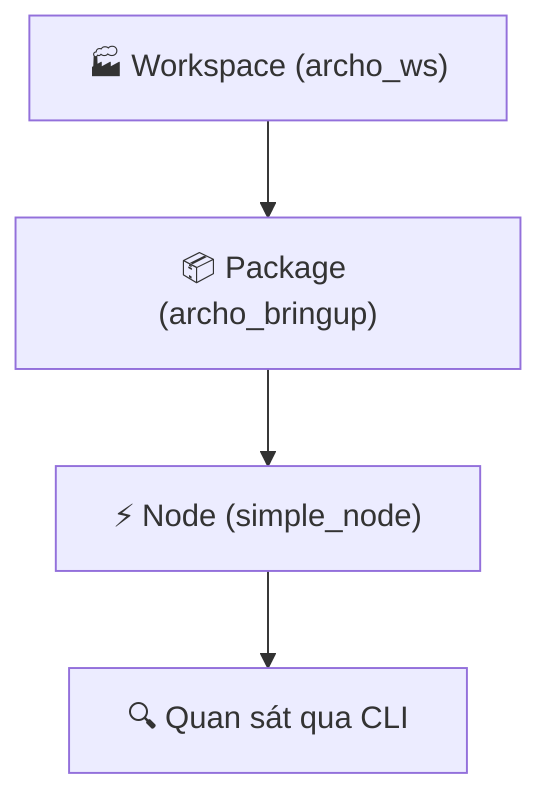
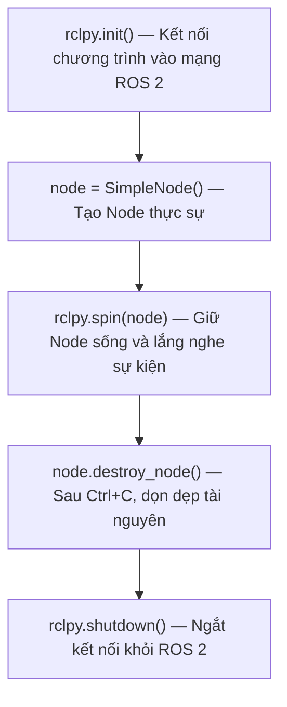

# 📘 Chương 2: Môi Trường Phát Triển ROS 2

> **ROS 2 — Từ Số 0 Đến Robot Thực Tế**  
> *Dựa trên giáo trình gốc [ROS 2 Zero to Robot](https://pouya-mansournia.github.io/ros2-zero-to-robot/02-development-environment.html) — Tác giả: Pouya Mansournia*

---

> [!WARNING]
> ## ⚠️ Lưu ý trước khi bắt đầu: Một số lệnh chưa có sẵn trên máy!
>
> Trong quá trình thực hành, bạn có thể gặp thông báo kiểu:
> ```
> Command 'tên_lệnh' not found, but can be installed with:
> sudo apt install tên_gói
> ```
> **Đừng hoảng!** Đây là bình thường vì Ubuntu mặc định chưa cài sẵn một số công cụ. Bạn chỉ cần chạy lệnh cài đặt mà hệ thống gợi ý là xong.
>
> Dưới đây là các công cụ hay bị thiếu và lệnh cài đặt nhanh:
>
> | Lệnh bị báo lỗi | Cài đặt bằng | Mục đích |
> |:---|:---|:---|
> | `tree` | `sudo apt install tree -y` | Xem cấu trúc cây thư mục |
> | `colcon` | `sudo apt install ros-dev-tools -y` | Công cụ build ROS 2 |
> | `ros2` | `source /opt/ros/lyrical/setup.bash` | Nạp môi trường ROS 2 |
>
> 💡 **Mẹo:** Để cài một lần tất cả các công cụ cần thiết cho chương này, chạy:
> ```bash
> sudo apt install tree ros-dev-tools -y
> ```

---

## 📑 Mục lục

- [2.1 — Từ Bản Đồ Đến Thành Phố](#21--từ-bản-đồ-đến-thành-phố)
- [2.2 — Workspace: "Nhà Máy" Của Dự Án](#22--workspace-nhà-máy-của-dự-án)
- [2.3 — Package: Đơn Vị Tổ Chức Mã Nguồn](#23--package-đơn-vị-tổ-chức-mã-nguồn)
- [2.4 — Node Đầu Tiên: Giải Thích Từng Dòng Code](#24--node-đầu-tiên-giải-thích-từng-dòng-code)
- [2.5 — Biên Dịch Và Chạy Với Colcon](#25--biên-dịch-và-chạy-với-colcon)
- [2.6 — Quan Sát Node Từ Bên Ngoài](#26--quan-sát-node-từ-bên-ngoài)
- [2.7 — Tổng Kết Chương 2](#27--tổng-kết-chương-2)

---

## 2.1 — Từ Bản Đồ Đến Thành Phố

Khi kết thúc Chương 1, bạn đã có **bản đồ kiến trúc** của ARCHO trong đầu: biết **Node** là gì, **Topic** là gì, khi nào dùng **Service**, khi nào dùng **Action**. Nhưng bản đồ, tự nó, chẳng làm robot di chuyển được.

Bây giờ là lúc **bước vào thành phố thực sự**: mở một thư mục trên hệ thống của bạn, viết một file Python, và lần đầu tiên nhìn thấy từ `Node` — thứ cho đến giờ chỉ là khái niệm trừu tượng — trở thành một **tiến trình sống** mà bạn có thể kiểm tra, giám sát và tương tác bằng dòng lệnh.



---

## 2.2 — Workspace: "Nhà Máy" Của Dự Án

### Vấn đề: Một thư mục Desktop lộn xộn

Hãy tưởng tượng ngày đầu tiên nhóm ARCHO bắt tay vào viết code. Một thành viên, không suy nghĩ nhiều, ném tất cả vào thẳng thư mục Desktop: `camera.cpp`, `main.py`, `lidar_driver.cpp`, `motor.py`, `map.yaml`... Một tuần sau, không ai nhớ file nào thuộc module nào, thư viện xung đột, code build lỗi vì file lẫn lộn. Đây là bức tường mà mọi đội robot sớm muộn đều đâm đầu vào nếu không có cấu trúc thư mục rõ ràng.

Giải pháp rất đơn giản: tạo một thư mục gốc và giữ mọi thứ có tổ chức bên trong. ROS 2 đã chính thức hóa ý tưởng này dưới cái tên **Workspace**.

> 📖 **Định nghĩa: Workspace**
>
> Workspace là thư mục gốc chứa toàn bộ các ROS package, file build và sản phẩm đầu ra của một dự án. Mỗi dự án độc lập (ví dụ: ARCHO so với một cánh tay robot khác) thường có một Workspace riêng biệt.

### Cấu trúc 4 thư mục chuẩn

Khi Workspace đã được tạo và build ít nhất một lần, bên trong nó sẽ có đúng 4 thư mục:

```text
archo_ws/
├── src/
├── build/
├── install/
└── log/
```

Đây là sơ đồ cấu trúc thư mục, **không phải** lệnh bạn gõ vào terminal. Bạn **không** tự tạo cả 4 thư mục này. Trên thực tế, chỉ có **một** thư mục do bạn tạo — ba thư mục còn lại được sinh tự động:

| Thư mục | Ai tạo? | Vai trò | Bạn có sửa tay không? |
|:---|:---|:---|:---|
| `src/` | **Bạn** (dùng `mkdir`) | Chứa toàn bộ code; mỗi Package là một thư mục con | Hầu như luôn luôn — **95% công việc** diễn ra ở đây |
| `build/` | `colcon build` tự sinh | Chứa file biên dịch tạm thời | Hầu như **không bao giờ** |
| `install/` | `colcon build` tự sinh | Phiên bản hoàn thiện, sẵn sàng chạy sau khi build | Chỉ dùng để `source` |
| `log/` | `colcon build` tự sinh | Nhật ký báo cáo từ mỗi lần build và chạy | Chỉ xem khi debug lỗi build |

---

### Bước 1 — Tự tay tạo Workspace

Bạn chỉ cần tạo thư mục `src`. Mọi thứ khác sẽ tự xuất hiện sau. Chạy lệnh này trong terminal:

```bash
mkdir -p ~/archo_ws/src
cd ~/archo_ws
```

`mkdir` tạo một thư mục; cờ `-p` sẽ tạo cả thư mục cha nếu chưa tồn tại (ở đây là `archo_ws`, trước khi tạo `src` bên trong) và không báo lỗi nếu thư mục đã có sẵn. `~` là thư mục home của bạn. Lúc này, Workspace trông như thế này:

```text
archo_ws/
└── src/
```

Vậy thôi — chưa có `build`, `install`, hay `log`, vì chưa có gì được build cả.

---

### Bước 2 — Để colcon sinh ra phần còn lại

Khi đã có ít nhất một Package bên trong `src` (bạn sẽ tạo ở mục tiếp theo), chạy công cụ build từ bên trong `archo_ws`:

```bash
colcon build
```

sẽ tự động tạo `build/`, `install/` và `log/` cho bạn. Bạn **không bao giờ** tự tạo 3 thư mục này bằng tay, và cũng không nên chỉnh sửa file bên trong chúng — chúng được sinh lại mỗi lần build.

> ⚠️ **Kiểm tra nhanh**
>
> Ngay sau khi chạy `mkdir -p ~/archo_ws/src`, lệnh `ls ~/archo_ws` chỉ nên hiện `src`. Nếu bạn thấy `build`, `install` hoặc `log` đã có sẵn thì nghĩa là `colcon build` đã từng được chạy trước đó — không sao cả, chỉ là bạn đã đi trước một bước so với hướng dẫn.

---

### 🧠 Phép so sánh: Nhà máy

Hãy nghĩ Workspace như một **nhà máy**:
- `src` là nơi **các kỹ sư thiết kế** sản phẩm
- `build` là **dây chuyền lắp ráp** biến nguyên liệu thô thành sản phẩm
- `install` là **nhà kho** chứa thành phẩm sẵn sàng xuất xưởng
- `log` là **sổ báo cáo hàng ngày** — nếu một sản phẩm bị lỗi, bạn xem sổ báo cáo để tìm lỗi xảy ra ở đâu trên dây chuyền

---

### 🌍 Nhiều Workspace cho nhiều mục đích

Trong dự án thực tế, bạn thường có **nhiều hơn một** Workspace trên hệ thống cùng lúc — ví dụ `~/archo_ws` cho code chính của robot, và `~/simulation_ws` cho các thí nghiệm mô phỏng chưa sẵn sàng gộp vào code chính. Sự tách biệt này giúp code thử nghiệm không lẫn với code ổn định.

---

### Kiểm tra trên hệ thống của bạn

Hiện tại, vì bạn mới chỉ tạo thư mục chứ chưa build gì, Workspace bên trong `src` vẫn trống:

```bash
cd ~/archo_ws
tree -L 1
```

```text
.
└── src

1 directory, 0 files
```

> ⚠️ **Lưu ý viết hoa/thường**
>
> Nếu bạn gõ nhầm `tree -l 1` (chữ `l` thường) thay vì `tree -L 1` (chữ `L` hoa), Linux sẽ tưởng `1` là tên thư mục và in ra `[error opening dir]`. Chữ `-L` hoa nghĩa là *"chỉ hiển thị thư mục đến độ sâu này"* — đây là một trong những lỗi đánh máy phổ biến nhất ngày đầu tiên.

---

### 📝 Bài tập dễ

Trong terminal của bạn, chạy: `cd ~/archo_ws`, sau đó `pwd`, sau đó `tree -L 1`. Xác nhận rằng bạn chỉ thấy `src` — nếu `build`, `install` hoặc `log` đã hiện, nghĩa là bạn đã build trước đó, không sao cả.

---

## 2.3 — Package: Đơn Vị Tổ Chức Mã Nguồn

Nếu Workspace là nhà máy, thì **Package** là một trong các **phân xưởng** bên trong nhà máy đó. Một robot thực tế như ARCHO thường có nhiều Package độc lập, không phải một thư mục khổng lồ:

```text
archo_ws/
└── src/
    ├── archo_description    # Mô hình vật lý URDF của robot
    ├── archo_bringup        # Khởi động toàn bộ hệ thống
    ├── archo_control        # Điều khiển động cơ và chuyển động
    ├── archo_navigation     # Cấu hình Nav2 và lập kế hoạch đường đi
    ├── archo_sensors        # Driver Camera, LiDAR, IMU
    └── archo_interfaces     # Định nghĩa Message/Service/Action tùy chỉnh
```

> 📖 **Định nghĩa: Package**
>
> Package là đơn vị tổ chức nhỏ nhất, có thể build được trong ROS 2. Một Package có thể chứa Node, code Python hoặc C++, Launch file, định nghĩa Parameter, Message, Service, Action, file URDF, cấu hình RViz, và test.

Không có thư mục nào ở trên tồn tại sẵn trên hệ thống của bạn — bạn chưa tạo Package nào cả, và ROS 2 cũng không tự tạo chúng. Package được tạo bằng lệnh `ros2 pkg create`.

---

### 🛠️ Thực hành: Tạo Package đầu tiên

Hãy tạo Package đầu tiên của nhóm ARCHO, `archo_bringup`, dưới dạng Python Package:

```bash
cd ~/archo_ws/src
ros2 pkg create --build-type ament_python archo_bringup
```

Chạy lệnh này **từ bên trong `~/archo_ws/src`** — đó là nơi mọi Package sống. `ros2 pkg create` sinh ra một thư mục mới đặt theo tên Package, đã chứa sẵn các file tiêu chuẩn mà một Python ROS 2 Package cần (`package.xml`, `setup.py`, v.v.). Bạn **không** tự tạo những file đó bằng tay; lệnh tạo giúp bạn.

Bây giờ vào Package và xem cấu trúc:

```bash
cd ~/archo_ws/src/archo_bringup
tree -L 3
```

```text
archo_bringup/
├── archo_bringup/
│   ├── __init__.py
│   └── simple_node.py
├── package.xml
├── resource/
├── setup.cfg
├── setup.py
└── test/
```

> ⚠️ **Tại sao có hai thư mục trùng tên?**
>
> Thấy `archo_bringup/archo_bringup/` không phải là lỗi. Thư mục bên ngoài là **ROS 2 Package**; thư mục bên trong là **Python Module** — nơi chứa các file code Node thực tế.

```text
ROS Package
└── Python Module
    └── ROS Nodes
```

---

### Các file quan trọng trong Package

| File | Vai trò |
|:---|:---|
| `package.xml` | "Chứng minh thư" của Package: tên, phiên bản, mô tả, tác giả, danh sách dependency |
| `setup.py` | Khai báo cho Python và ROS: tên package, file nào cần cài đặt, Node nào có thể chạy |
| `setup.cfg` | Chỉ định nơi cài đặt file thực thi Python |
| `__init__.py` | Khai báo thư mục này là Python module; phải tồn tại dù rỗng |

Để xác định Package được build bằng Python hay C++, bạn chỉ cần kiểm tra:

```bash
grep build_type package.xml
# <build_type>ament_python</build_type>   → Python
# <build_type>ament_cmake</build_type>    → thường là C++
```

---

### 🔧 Góc nhìn kỹ sư: Package vs Node

Đừng nhầm lẫn hai khái niệm này. Một Workspace có thể chứa nhiều Package, và một Package có thể chứa nhiều Node — ví dụ, `archo_sensors` có thể chứa `camera_node`, `imu_node` và `battery_node` cùng lúc. Nhưng trong dự án chuyên nghiệp, mỗi Package nên **tập trung vào một lĩnh vực trách nhiệm duy nhất** thay vì phình to và lộn xộn.

---

### 📝 Bài tập trung bình

Bên trong `archo_bringup`, chạy `grep build_type package.xml` và `cat setup.py`. Trong `setup.py`, tìm dòng chứa `console_scripts` và cho biết tên nào được đăng ký để chạy Node.

---

## 2.4 — Node Đầu Tiên: Giải Thích Từng Dòng Code

Lệnh `ros2 pkg create` **không viết code Node** cho bạn — nó chỉ sinh ra bộ khung trống (thư mục và file boilerplate). Chúng ta vẫn phải tự tay viết Node.

Tạo file mới tại `~/archo_ws/src/archo_bringup/archo_bringup/simple_node.py` với nội dung bên dưới, sau đó mở `setup.py` và thêm một dòng vào `entry_points` để ROS 2 biết file này chứa Node có thể chạy:

### Đăng ký Node trong `setup.py`:

```python
entry_points={
    'console_scripts': [
        'simple_node = archo_bringup.simple_node:main',
    ],
},
```

Dòng này mang **ba thông tin quan trọng** mà bạn cần giải mã riêng biệt:

| Phần | Ý nghĩa |
|:---|:---|
| `simple_node` *(bên trái dấu =)* | Tên bạn dùng với lệnh `ros2 run` |
| `archo_bringup.simple_node` | Đường dẫn file: `archo_bringup/simple_node.py` |
| `:main` | Khi Node chạy, hàm `main()` sẽ được gọi |

---

### Nội dung file `simple_node.py`:

```python
import rclpy
from rclpy.node import Node


class SimpleNode(Node):
    def __init__(self):
        super().__init__('simple_node')
        self.get_logger().info('Hello from ARCHO — first node alive!')


def main(args=None):
    rclpy.init(args=args)
    node = SimpleNode()
    rclpy.spin(node)
    node.destroy_node()
    rclpy.shutdown()


if __name__ == '__main__':
    main()
```

Bây giờ hãy đi qua từng dòng — theo cách một kỹ sư có kinh nghiệm sẽ review code của đồng nghiệp mới.

---

### `import rclpy`

`rclpy` là thư viện cốt lõi của ROS 2 dành cho Python — viết tắt của **ROS Client Library for Python**. Phiên bản C++ tương ứng gọi là `rclcpp`. Không có `rclpy`, chương trình Python của bạn chỉ là script bình thường, không có cách nào kết nối vào mạng ROS 2.

---

### `from rclpy.node import Node`

Ở đây chúng ta import class `Node` có sẵn — chính là class đã thảo luận trong Chương 1. Class này đã được trang bị sẵn khả năng tạo Publisher, Subscriber, Service, Action, Parameter, Timer và Logger; chúng ta chỉ đơn giản **kế thừa** từ nó.

---

### `class SimpleNode(Node):` và `super().__init__('simple_node')`

Tạo một class kế thừa `Node`, rồi gọi `super().__init__('simple_node')` để đăng ký Node này với mạng ROS 2 dưới tên `simple_node`.

> 💡 **Lưu ý quan trọng:** `SimpleNode` là tên class Python, nhưng `simple_node` (bên trong `super().__init__`) là **tên mà Node này được nhận diện trên mạng ROS 2**. Vì vậy, khi chạy `ros2 node list`, bạn sẽ thấy `/simple_node`, **không phải** `SimpleNode`.

---

### `self.get_logger().info(...)`

Dòng này in thông báo bằng **hệ thống logging tích hợp** của ROS. Bạn có thể dùng `print()` của Python thay thế, nhưng Logger có nhiều ưu điểm hơn: hiển thị tên Node, đánh dấu mức độ nghiêm trọng, gắn timestamp, và cho phép bạn theo dõi thông báo trên Topic `/rosout`.

| Mức độ | Công dụng |
|:---|:---|
| `debug()` | Chi tiết kỹ thuật, chỉ dùng khi phát triển |
| `info()` | Trạng thái bình thường và thông báo thường ngày |
| `warning()` | Có thể có vấn đề phía trước |
| `error()` | Một lỗi đã xảy ra |
| `fatal()` | Lỗi rất nghiêm trọng khiến không thể tiếp tục |

---

### Hàm `main()` — Trái Tim Của Quá Trình Thực Thi

Thứ tự 5 dòng bên trong `main()` rất quan trọng, và **pattern này luôn lặp lại**:



---

### 🧠 Phép so sánh: Tổng đài viên

Hãy nghĩ `rclpy.spin(node)` như việc **thuê một tổng đài viên**. Không có `spin()`, tổng đài viên bước vào văn phòng, nói một câu, rồi **lập tức đi về** — Node được tạo ra, thông báo được in, và nó tắt ngay lập tức. Nhưng `spin()` nói: *"hãy ngồi cạnh điện thoại và chờ cuộc gọi."* Những "cuộc gọi" đó chính xác là những gì sau này sẽ xuất hiện dưới dạng Message, yêu cầu Service, Timer kích hoạt, hoặc Action Goal.

Và cuối cùng, ở cuối file, `if __name__ == '__main__': main()` chỉ là quy ước chuẩn Python: nếu file này được chạy trực tiếp (không thông qua `ros2 run`), `main()` vẫn được gọi.

---

## 2.5 — Biên Dịch Và Chạy Với Colcon

Khi một file bên trong `src` thay đổi, ROS vẫn chưa biết về phiên bản đã cài đặt. Chúng ta cần **build Workspace từ thư mục gốc**:

```bash
cd ~/archo_ws
colcon build --packages-select archo_bringup
```

> 📖 **Colcon là gì?**
>
> `colcon` là công cụ build chính thức của ROS 2. Nhiệm vụ của nó là tìm tất cả Package trong `src`, kiểm tra dependency, biên dịch chúng, tạo thư mục `install`, và đăng ký các file thực thi. Chạy `colcon build` một mình sẽ build **mọi** Package; thêm `--packages-select` chỉ build **một** package duy nhất, tiết kiệm rất nhiều thời gian trên dự án lớn.

Sau khi build, bạn cần **"kích hoạt"** Workspace để terminal biết các Package nằm ở đâu:

```bash
source install/setup.bash
```

> ⚠️ **Lưu ý quan trọng**
>
> Mỗi terminal mới bạn mở đều cần chạy `cd ~/archo_ws` và `source install/setup.bash` lại. **Quên bước này là nguyên nhân phổ biến nhất** gây ra thông báo `"Package not found"` trong những ngày đầu tiên.

Bây giờ chạy Node:

```bash
ros2 run archo_bringup simple_node
```

**Kết quả:**
```text
[INFO] [simple_node]: Hello from ARCHO — first node alive!
```

Node vẫn tiếp tục chạy sau khi in thông báo — điều này **hoàn toàn bình thường**, vì `rclpy.spin(node)` vẫn đang thực thi. Nhấn `Ctrl+C` để dừng.

---

## 2.6 — Quan Sát Node Từ Bên Ngoài

Phần này giới thiệu một trong những **thói quen quan trọng** bạn nên xây dựng ngay từ đầu: **kiểm tra mọi Node bạn chạy từ một terminal thứ hai**.

Giữ nguyên terminal đầu tiên (Node vẫn đang chạy), mở **terminal thứ hai**, và:

```bash
source /opt/ros/lyrical/setup.bash
cd ~/archo_ws
source install/setup.bash
ros2 node list
```

Bạn sẽ thấy `/simple_node`. Để xem thông tin chi tiết hơn:

```bash
ros2 node info /simple_node
```

Output hiển thị danh sách Subscriber, Publisher, Service Server & Client, và Action Server & Client của Node — hiện tại, chúng đều trống vì Node này chỉ in một thông báo. Nhưng bạn có thể thấy hai Topic nội bộ của ROS: `/parameter_events` và `/rosout`.

---

### 🌍 Ngay cả Log cũng truyền qua Topic

Khi bạn gọi `self.get_logger().info(...)`, thông báo **không chỉ** được in ra terminal mà còn được **publish lên Topic `/rosout`**. Nếu bạn chạy lệnh này ở terminal thứ hai:

```bash
ros2 topic echo /rosout
```

Bạn sẽ thấy các thông báo log xuất hiện trực tiếp. Điều này cho thấy ngay cả hệ thống logging cũng được xây dựng trên cùng hạ tầng **Publish/Subscribe** từ Chương 1 — trong ROS 2, hầu hết mọi thứ, kể cả logging nội bộ, đều dựa vào cùng một vài khái niệm cốt lõi.

---

### Minh họa: Hai terminal song song

```text
┌───────────────────────────────────────┐    ┌───────────────────────────────────────┐
│ Terminal 1 — Chạy Node               │    │ Terminal 2 — Giám sát trực tiếp       │
│                                       │    │                                       │
│ $ ros2 run archo_bringup simple_node  │    │ $ ros2 node list                      │
│ [INFO] [simple_node]:                 │    │ /simple_node                          │
│ Hello from ARCHO — first node alive!  │    │                                       │
│ (node tiếp tục sống — spin)           │    │ $ ros2 topic echo /rosout             │
│                                       │    │ msg: "Hello from ARCHO..."            │
└───────────────────────────────────────┘    └───────────────────────────────────────┘
```

*Hình 2.1 — Luôn kiểm tra Node từ terminal thứ hai; thói quen này sau này trở nên thiết yếu khi debug các Node phức tạp.*

---

### 📝 Bài tập nâng cao

Chạy Node ở terminal đầu tiên, sau đó chạy `ros2 node info /simple_node` ở terminal thứ hai. Ghi lại toàn bộ output và giải thích **tại sao** danh sách Publisher và Subscriber của Node này (ngoài các Topic nội bộ của ROS) lại trống.

---

## 2.7 — Tổng Kết Chương 2

Bạn đã đi trọn con đường: bạn **tạo một Workspace**, tìm thấy một **Package** bên trong nó và mổ xẻ cấu trúc, đọc **Node** đầu tiên thực sự của ARCHO **từng dòng từng dòng**, build nó bằng `colcon build`, chạy nó bằng `ros2 run`, và kiểm tra nó trực tiếp từ terminal thứ hai.

Đây là lần đầu tiên bạn **chạm tay** vào các khái niệm trừu tượng của Chương 1 trên hệ thống thực của mình.

---

### ✅ Điểm kiểm tra kiến thức

- [ ] Tôi có thể giải thích **Workspace** là gì và tại sao mọi dự án đều cần một cái.
- [ ] Tôi biết vai trò của từng thư mục `src`, `build`, `install`, và `log`.
- [ ] Tôi có thể phân biệt **Package** với **Node** và giải thích mối quan hệ giữa chúng.
- [ ] Tôi có thể giải thích file `rclpy` đơn giản **từng dòng một**.
- [ ] Tôi biết tại sao cần `rclpy.spin()` và điều gì xảy ra nếu thiếu nó.
- [ ] Tôi có thể build, chạy và kiểm tra một Node từ terminal thứ hai.

---

### 🔗 Kết nối với dự án chính

**Dự án ARCHO** giờ đã có Package đầu tiên và Node thực sự đầu tiên — nó mới chỉ in một câu chào, nhưng hạ tầng Workspace và Package đã sẵn sàng để chúng ta biến Node im lặng này thành một Publisher thực thụ ở chương tiếp theo.

---

### 🔮 Chương tiếp theo thêm gì?

Trong **Chương 3**, chúng ta sẽ biến chính `simple_node` này thành một **Publisher** phát Message lên một Topic thực sự **mỗi giây**, và xây dựng một **Subscriber** riêng biệt để nhận Message đó. Lần đầu tiên, bạn sẽ tận mắt thấy **hai Node độc lập** — đúng như mô tả trong Chương 1 — **nói chuyện với nhau**.

---

### 📖 Từ điển thuật ngữ Chương 2

| Thuật ngữ | Định nghĩa |
|:---|:---|
| **Workspace** | Thư mục gốc chứa tất cả Package, file build và sản phẩm đầu ra của một dự án ROS 2 |
| **Package** | Đơn vị tổ chức nhỏ nhất, có thể build được trong ROS 2; có thể chứa Node, Launch file, Parameter, v.v. |
| **colcon** | Công cụ build chính thức của ROS 2, biên dịch và cài đặt các Package bên trong `src` |
| **rclpy** | Thư viện client ROS 2 cho Python; cầu nối giữa chương trình Python và mạng ROS 2 |
| **spin()** | Hàm giữ Node sống và chờ đợi sự kiện ROS (Message, Service, Timer, Action) |
| **Logger** | Hệ thống logging tích hợp của ROS, publish thông báo lên Topic `/rosout` ngoài việc in ra terminal |
| **entry_points** | Phần trong `setup.py` liên kết tên lệnh chạy của Node với file và hàm `main` tương ứng |

---

### ❌ Các lỗi phổ biến Chương 2 — Tổng hợp

| # | Lỗi | Hậu quả |
|:---:|:---|:---|
| 1 | Quên `source install/setup.bash` sau khi mở terminal mới | Báo lỗi `"Package not found"` |
| 2 | Nhầm lẫn tên class Python (`SimpleNode`) với tên Node trên mạng ROS (`simple_node`) | Gõ sai tên khi dùng `ros2 run` hoặc `ros2 node info` |
| 3 | Xóa `rclpy.spin()` rồi ngạc nhiên khi Node tắt ngay lập tức | Node in xong câu chào và thoát, không đợi sự kiện |
| 4 | Build toàn bộ Workspace bằng `colcon build` thay vì dùng `--packages-select` trên dự án lớn | Tốn rất nhiều thời gian chờ build không cần thiết |
