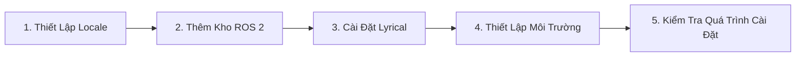

# 🚀 Hướng Dẫn Cài Đặt ROS 2 Lyrical (Ubuntu 26.04)

> Tài liệu hướng dẫn chi tiết dành riêng cho phiên bản **ROS 2 Lyrical** trên hệ điều hành **Ubuntu 26.04 (Resolute Ringtail)** theo đúng chuẩn tài liệu chính thức.

---

## 📌 Sơ Đồ Quy Trình Cài Đặt



---

## Bước 1: Thiết Lập Locale (Chuẩn UTF-8)

> **Mục đích:** ROS 2 yêu cầu hệ thống dùng chuẩn mã hóa UTF-8 để hỗ trợ đầy đủ các ký tự ngôn ngữ trên toàn hệ thống.

### 💻 Lệnh chạy:
```bash
sudo apt update && sudo apt install locales -y
sudo locale-gen en_US en_US.UTF-8
sudo update-locale LC_ALL=en_US.UTF-8 LANG=en_US.UTF-8
export LANG=en_US.UTF-8
```

### 🔍 Giải thích từng lệnh:
* `sudo apt update`: Cập nhật danh sách gói phần mềm của hệ thống.
* `sudo apt install locales -y`: Cài đặt gói công cụ quản lý ngôn ngữ.
* `sudo locale-gen en_US en_US.UTF-8`: Sinh bộ mã ngôn ngữ tiếng Anh UTF-8.
* `sudo update-locale LC_ALL=en_US.UTF-8 LANG=en_US.UTF-8`: Thiết lập locale mặc định cho toàn bộ hệ điều hành.
* `export LANG=en_US.UTF-8`: Đặt biến môi trường ngôn ngữ cho phiên làm việc hiện tại.

### ✅ Dấu hiệu thành công:
Gõ lệnh `locale`, bạn thấy màn hình hiện các dòng có giá trị `en_US.UTF-8`.

---

## Bước 2: Kích Hoạt Repositories & Thêm Kho ROS 2

> **Mục đích:** Thêm kho phần mềm chính thức của ROS 2 vào Ubuntu để tải các gói deb.

### 💻 Lệnh chạy:
```bash
# 1. Kích hoạt kho Universe
sudo apt install software-properties-common -y
sudo add-apt-repository universe -y

# 2. Cài đặt curl
sudo apt update && sudo apt install curl -y

# 3. Tải và cài đặt cấu hình kho lưu trữ chính thức của ROS 2
export ROS_APT_SOURCE_VERSION=$(curl -s https://api.github.com/repos/ros-infrastructure/ros-apt-source/releases/latest | grep -F "tag_name" | awk -F'"' '{print $4}')
curl -L -o /tmp/ros2-apt-source.deb "https://github.com/ros-infrastructure/ros-apt-source/releases/download/${ROS_APT_SOURCE_VERSION}/ros2-apt-source_${ROS_APT_SOURCE_VERSION}.$(. /etc/os-release && echo ${UBUNTU_CODENAME:-${VERSION_CODENAME}})_all.deb"
sudo dpkg -i /tmp/ros2-apt-source.deb
```

### 🔍 Giải thích từng lệnh:
* `add-apt-repository universe`: Mở kho Universe của Ubuntu (chứa các dependency phụ thuộc của ROS 2).
* `export ROS_APT_SOURCE_VERSION=...`: Truy vấn GitHub API lấy phiên bản gói cấu hình mới nhất.
* `curl -L -o /tmp/ros2-apt-source.deb ...`: Tải file `.deb` cấu hình kho phù hợp cho Ubuntu `resolute`.
* `sudo dpkg -i /tmp/ros2-apt-source.deb`: Cài file `.deb` để thêm URL kho và khóa GPG vào hệ thống apt.

### ✅ Dấu hiệu thành công:
Chạy lệnh `sudo apt update`, bạn nhìn thấy có dòng:
```text
Hit: ... http://packages.ros.org/ros2/ubuntu resolute InRelease
```

---

## Bước 3: Cài Đặt ROS 2 Lyrical

> **Mục đích:** Tải và cài đặt phiên bản ROS 2 Lyrical Desktop.

### 💻 Lệnh chạy:
```bash
sudo apt update
sudo apt upgrade -y
sudo apt install ros-lyrical-desktop -y
```

### 🔍 Giải thích:
* `sudo apt update`: Đồng bộ lại danh mục sau khi đã thêm kho ROS 2.
* `sudo apt upgrade -y`: Cập nhật các gói phần mềm trên hệ thống lên phiên bản mới nhất.
* `sudo apt install ros-lyrical-desktop -y`: Cài đặt toàn bộ thành phần chính của ROS 2 (thư viện lõi, công cụ trực quan hóa 3D **RViz**, demos, tutorials).
* Quá trình này tải khoảng 2 - 3 GB, mất từ **5 - 15 phút** tùy tốc độ mạng.

### ✅ Dấu hiệu thành công:
Màn hình chạy đến dòng `Setting up ros-lyrical-desktop...` và quay trở về dấu nhắc lệnh `user@machine:~$ ` mà không có lỗi.

---

## Bước 4: Thiết Lập Môi Trường (Theo Chuẩn Tài Liệu)

> **Mục đích:** Nạp tập tin thiết lập môi trường để terminal có thể gọi và sử dụng các lệnh của ROS 2.

### 💻 Lệnh chạy:
```bash
source /opt/ros/lyrical/setup.bash
```

> [!NOTE]
> **Lưu ý theo tài liệu chính thức:**  
> Nếu bạn không sử dụng `bash`, hãy thay thế `.bash` bằng shell tương ứng mà bạn đang dùng:
> * Dùng Bash: `source /opt/ros/lyrical/setup.bash`
> * Dùng SH: `source /opt/ros/lyrical/setup.sh`
> * Dùng Zsh: `source /opt/ros/lyrical/setup.zsh`

### ✅ Dấu hiệu thành công:
Sau khi chạy lệnh `source`, terminal sẽ không báo lỗi gì và lập tức quay lại dấu nhắc lệnh. Bạn có thể gõ `ros2 --help` để xem menu lệnh của ROS 2.

---

## Bước 5: Kiểm Tra Quá Trình Cài Đặt

> **Mục đích:** Chạy các ví dụ mẫu có sẵn để kiểm tra xem cả API C++ và Python của ROS 2 đã hoạt động chuẩn xác hay chưa.

Mở **hai cửa sổ dòng lệnh riêng biệt** và thao tác:

### 🟢 1. Trong cửa sổ terminal thứ nhất (Chạy Talker C++):
Nạp tệp thiết lập, sau đó chạy trình phát tin nhắn mã C++:
```bash
source /opt/ros/lyrical/setup.bash
ros2 run demo_nodes_cpp talker
```

*Bạn sẽ thấy bên phát thông báo rằng nó đang gửi tin nhắn ra bên ngoài:*
```text
[INFO] [talker]: Publishing: 'Hello World: 1'
[INFO] [talker]: Publishing: 'Hello World: 2'
[INFO] [talker]: Publishing: 'Hello World: 3'
```

---

### 🔵 2. Trong cửa sổ terminal thứ hai (Chạy Listener Python):
Nạp tệp thiết lập, sau đó chạy trình lắng nghe mã Python:
```bash
source /opt/ros/lyrical/setup.bash
ros2 run demo_nodes_py listener
```

*Bạn sẽ thấy bên nhận thông báo rằng nó đã nghe được những tin nhắn đó:*
```text
[INFO] [listener]: I heard: [Hello World: 1]
[INFO] [listener]: I heard: [Hello World: 2]
[INFO] [listener]: I heard: [Hello World: 3]
```

> [!TIP]
> Điều này xác minh rằng **cả API C++ và Python đều hoạt động đúng cách**.  
> Bạn có thể bấm tổ hợp phím **`Ctrl + C`** ở mỗi cửa sổ để dừng chương trình.
